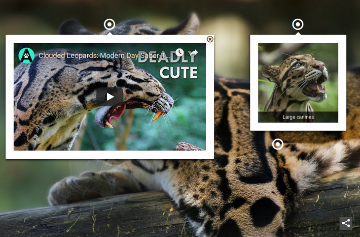

# Interactive Image [](http://badge.fury.io/js/interactiveimagejs) [](https://travis-ci.org/jpchateau/Interactive-Image) [](https://codeclimate.com/github/jpchateau/Interactive-Image)

> A jQuery plugin to embed interactive images on your website.

[](https://www.jpchateau.com/demo/interactive-image)

[Online Demo](https://www.jpchateau.com/demo/interactive-image).

## Features

* Interactive videos, sounds, images and texts over large pictures
* Support for popular content providers
* Social media sharing capabilities
* Flexible configuration of markers and items
* Easily customizable with CSS
* Unit tested with [Mocha](https://mochajs.org/)
* Installable via package managers
* No restriction on commercial use

## Documentation

The technical documentation is hosted at [Read the docs](https://interactive-image.readthedocs.io).

## Tests

All builds are unit tested with [Mocha](https://mochajs.org/) and [Chai](https://www.chaijs.com/).
Check it out on [Travis CI](https://travis-ci.org/jpchateau/Interactive-Image)!

### Run all unit tests
```sh
$ npm run test
```

### Run all unit tests and display code coverage
```sh
$ npm run test-with-coverage
```

## Browser Support

|  |  |  |  |  |
| --- | --- | --- | --- | --- |
| Latest ✔ | Latest ✔ | Latest ✔ | Latest ✔ | Latest ✔ |

## Philosophy

This tool is not just a means to create rich media contents. It focuses on code quality and cares about web performances.  
A good code base, following the language good pratices, reduces maintainability issues and could be used as example. 

## Contribute

Feel free to contribute and open some issues or pull requests.  
This jQuery plugin uses [npm](https://www.npmjs.com/) to manage dependencies and [webpack](https://webpack.js.org/) as bundler.  
See the complete contributing guidelines [here](CONTRIBUTING.md).

## Alternatives

* For business:
  * [genially](https://www.genial.ly/)
  * [ImageMarker](https://www.imagemarker.com/)
  * [ThingLink](https://www.thinglink.com/)
* Premium:
  * [imageLinks](http://avirtum.com/imagelinks-jquery-plugin/)
* Free:
  * [jquery.hotspot.js](https://github.com/skypluto/jquery.hotspot.js)

## License

Copyright (c) 2015-2019 Jean-Philippe Chateau.  
This content is released under [the MIT license](https://github.com/jpchateau/Interactive-Image/blob/master/LICENSE).
