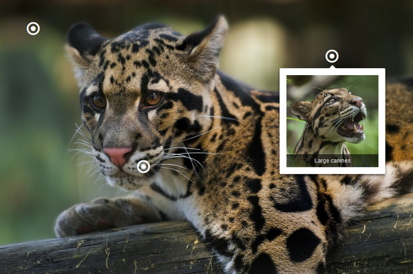

# Interactive Image [](http://badge.fury.io/js/interactiveimagejs) [](https://travis-ci.org/jpchateau/Interactive-Image) [](https://codeclimate.com/github/jpchateau/Interactive-Image)

> A jQuery plugin to embed interactive images on your website.



View [demo page](https://www.jpchateau.com/demo/interactive-image).

## Features

* Interactive texts and images over large pictures
* Flexible configuration of markers and items
* Easily customizable with CSS
* Installable via package managers

## Browser Support

|  |  |  |  |  |  |
| --- | --- | --- | --- | --- | --- |
Latest ✔ | Latest ✔ | Latest ✔ | Latest ✔ | Latest ✔ | 8+ ✔ |

## Installation

**Important:** [jQuery](https://jquery.com/download/) 1.7.2+ is required.  
Install it via your package manager, a CDN or simply download it.

**npm**

```sh
$ npm install --save interactiveimagejs
```

**Yarn**

```sh
$ yarn add interactiveimagejs
```

**Download**

You can also download the production version or the development version from GitHub.  
All these files (js, css and fonts) are located in the `dist` directory.

## Usage

### Get started

Edit the source code of your web page:

**HTML**

```html
<head>
  <link rel="stylesheet" href="interactive-image.min.css" />
  <style>
  .interactive-image {
    width: 900px;
    height: 600px;
    background: url("/path/to/main-image.png");
  }
  </style>
</head>
<body>
  <div class="interactive-image"></div>  
  
  <!-- Do not forget to include jQuery here -->

  <script src="interactive-image.min.js"></script>
</body>
```

**Note regarding the css file:** You may have to rewrite the relative paths of the fonts.

**JavaScript**

```javascript
// Items collection
var items = [
  {
    type: "text",
    title: "Fur",
    description: "The fur of clouded leopards is...",
    position: {
        left: 100,
        top: 50
    }
  },
  {
    type: "picture",
    path: "/path/to/picture.png",
    caption: "A baby clouded leopard",
    position: {
      left: 200,
      top: 300
    }
  }
];

// Plugin activation
$(document).ready(function() {
  $(".interactive-image").interactiveImage(items);
});
```

### Style customization

You may want to change the rendering of an item, as for example the background and the front color of text items.  
Adapt this CSS snippet to your needs and add it after the `interactive-image` css file is loaded:

```css
.interactive-image .text-item {
  background-color: blue;
  color: yellow;
}
```

### Debugging

In order to display some console messages to see the different steps of the processing, add an `options` object to the app initialization:

```javascript
var options = {
  debug: true
};

$(document).ready(function() {
  $(".interactive-image").interactiveImage(items, options);
}); 
```

## Configuration

### Plugin configuration options

**Options**

| Property | Type    | Example | Required | Default | Purpose                 |
| ---------| ------- | ------- |:--------:| ------- | ----------------------- |
| debug    | boolean | true    | No       | false   | Logs enabled in console |

### Items

Each item has several possibilities of configuration.  
You can add a link and/or a picture to your `text` items, or a caption to your `picture` items.

**Text Item**

| Property    | Type   | Example                | Required | Default | Purpose                       |
| ----------- | ------ | ---------------------- |:--------:| ------- | ----------------------------- |
| type        | string | "text"                 | Yes      |         | Item type (text/picture)      |
| position    | object | See `Position` object  | Yes      |         | Hotspot position on the scene |
| title       | string | "My title"             | Yes      |         | Title                         |
| description | string | "My description"       | Yes      |         | Descriptive text              |
| picturePath | string | "/path/to/picture.png" | No       |         | Illustration                  |
| link        | object | See `Link` object      | No       |         | HTTP Link                     |

**Picture Item**

| Property    | Type   | Example                | Required | Default | Purpose                        |
| ----------- | ------ | ---------------------- |:--------:| ------- | ------------------------------ |
| type        | string | "picture"              | Yes      |         | Item type (text/picture)       |
| position    | object | See `Position` object  | Yes      |         | Hotspot position on the scene  |
| path        | string | "/path/to/picture.png" | Yes      |         | Illustration                   |
| caption     | string | "My caption"           | No       |         | Illustration small description |

### Other objects

**Position**

| Property    | Type    | Example | Required | Default | Purpose          |
| ----------- | ------- | ------- |:--------:| ------- | ---------------- |
| left        | integer | 200     | Yes      |         | X absolute value |
| top         | integer | 50      | Yes      |         | Y absolute value |

**Link**

| Property    | Type    | Example                  | Required | Default     | Purpose             |
| ----------- | ------- | ------------------------ |:--------:| ----------- | ------------------- |
| url         | string  | "https://www.github.com" | Yes      |             | href attribute      |
| label       | string  | "My webpage"             | No       | `url` value | Name of the webpage |

## TODO

* Make the plugin adaptive to all screens
* Add audio items
* Add video items

## Dependencies

* [imagesloaded](https://www.npmjs.com/package/imagesloaded) to detect when images have been loaded
* [performance-now](https://www.npmjs.com/package/performance-now) to monitor JavaScript performance
* [uniqid](https://www.npmjs.com/package/uniqid) to create unique id's 

## Contribute

Feel free to contribute and open some pull requests.  
This jQuery plugin uses [npm](https://www.npmjs.com/) to manage dependencies and [webpack](https://webpack.js.org/) as bundler.  
See the complete contributing guidelines [here](CONTRIBUTING.md).

## Alternatives

* Free: [iPicture](https://github.com/vincicat/jQuery-iPicture) (inactive)
* Premium: [imageLinks](http://avirtum.com/imagelinks-jquery-plugin/)
* For business: [ThingLink](https://www.thinglink.com/)

## License

Copyright (c) 2015-2018 Jean-Philippe Chateau.  
This content is released under [the MIT license](https://github.com/jpchateau/Interactive-Image/blob/master/LICENSE).